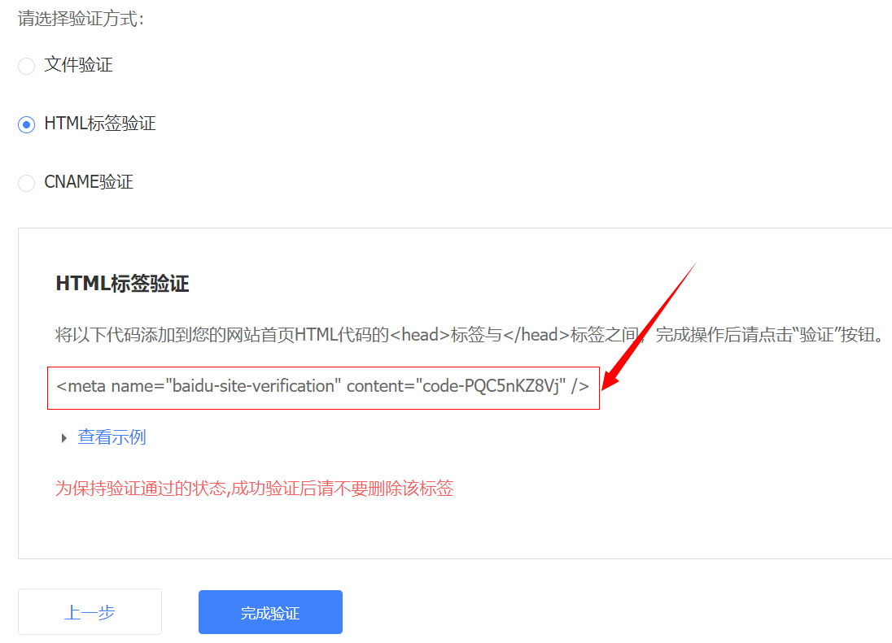
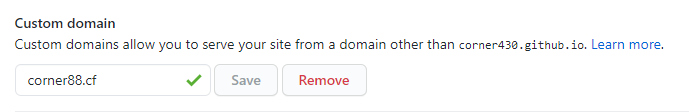
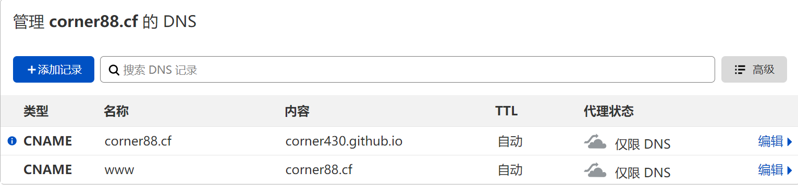
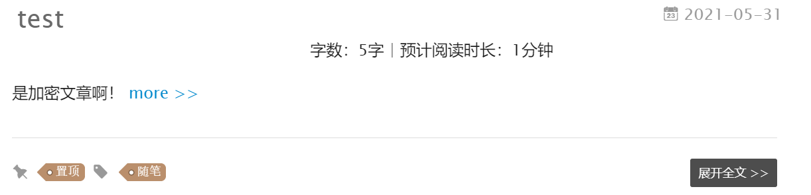
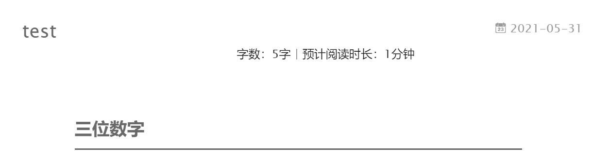
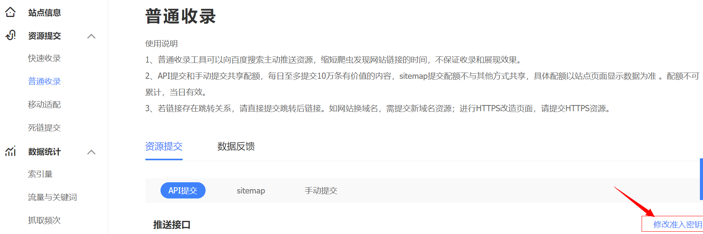

### 1. 添加百度统计<!--more-->
- 打开themes/yilia/layout/_partial/baidu-analytics.ejs，将在百度统计里面得到的代码粘进去
- 打开themes/yilia/_config.yml，将其中的baidu_analytics: ''写为baidu_analytics: 'true'

### 2. sitemap方式提交网页
- 安装sitemap
```shell
npm install hexo-generator-sitemap --save
hexo clean
hexo g
```

- 配置sitemap路径
打开本目录下的_config.yml文件，将`url`修改为博客的首页地址，这是为了保证sitemap.xml文件路径的正确性。
```yml
url: http://corner88.cf     #修改成你博客的首页地址
root: /
permalink: :year/:month/:day/:title/
permalink_defaults:
```
在合适的位置添加以下内容
```yml
# 自动生成sitemap
sitemap:
  path: sitemap.xml
```
之后输入命令重新部署博客。

- 提交文件
查看blog/public文件夹，可以看到sitemap.xml文件
sitemap的初衷是给搜索引擎看的，为了提高搜索引擎对自己站点的收录效果，最好手动到google和百度等搜索引擎提交sitemap.xml。
进入[百度提交网址](https://ziyuan.baidu.com/?castk=LTE%3D)，点击用户中心->添加网站，选择HTML标签验证。将出现的那行meta代码复制下来


- 配置
打开themes/layout/_partial/head.ejs文件，将复制的meta代码粘贴进去，注意位置！之后点击完成验证。

- 重新部署博客
`hexo clean && hexo g && hexo d`

- 资源提交
打开[百度站点普通收录控制台](https://ziyuan.baidu.com/linksubmit/index)，选择sitemap方式提交，填写正确的文件数据地址，例如我是`http://corner88.cf/sitemap.xml`，之后点击提交即可！

- Google
google类似于上述百度，[google搜索验证](https://www.google.com/webmasters/tools/home?hl=zh-CN)，[google站点控制台](https://search.google.com/search-console/sitemaps)
在google搜索验证中选择网址前缀填写博客网址即可，在google站点控制台添加新的站点地图提交即可。


### 3. 使用hexo画思维导图
- 首先进入到 Hexo 博客的根目录，执行`npm install hexo-simple-mindmap`安装插件。
写新文章时，在需要脑图的地方，按以下格式添加内容。插件会自动将 pullquote 中包裹的内容按照层级顺序渲染成脑图。
- 代码示例

```

- Fengx
	- 任何方向
		- 编程语言
			- Java
		- SQL
		- Linux
		- Git
	- 技术
		- Java Web
		- 数据库
		- Docker
		- svn
		- 消息队列(MQ)
		- mycat
		- 大数据
			- Hadoop
			- HBase
	- 内功
		- 计算机基础
			- 计算机网络
			- 计算机操作系统
			- 编译原理
			- 计算机组成原理
		- 数据结构与算法
		- 设计模式
		- 性能优化
		- 架构设计
		- 软件工程
	- 其他
		- 英语
		- 博客

```


- Fengx
	- 任何方向
		- 编程语言
			- Java
		- SQL
		- Linux
		- Git
	- 技术
		- Java Web
		- 数据库
		- Docker
		- svn
		- 消息队列(MQ)
		- mycat
		- 大数据
			- Hadoop
			- HBase
	- 内功
		- 计算机基础
			- 计算机网络
			- 计算机操作系统
			- 编译原理
			- 计算机组成原理
		- 数据结构与算法
		- 设计模式
		- 性能优化
		- 架构设计
		- 软件工程
	- 其他
		- 英语
		- 博客



### 4. 域名解析以及怎么给hexo绑定域名
> temp email
- 首先进入[freenom官网](https://www.freenom.com/zh/index.html)
    - 全程以美国IP进行，点击**Partners**申请账号。（需要美国身份信息）
    - 申请一个域名

- 进入[Cloudflare官网](https://dash.cloudflare.com/login)
其实freenom自带的已经有域名解析功能了，但这个是专业的，而且还能套CDN防止被墙
- 解析
    - 添加域名到cloudflare
    - 需要填写域名服务器，耐心等待检查
    - 添加A记录可以直接解析到IP上
    - 添加CNAME可以指向另一个网址
    - 直接输入'@'就是不加前缀
- 绑定到hexo
    1. 找到当前项目，点击Settings->Pages
    在Custom domain中输入自己的域名
    
    2. 在cloudflare->DNS中添加CNAME记录（不要勾选小云朵）
    
    3. 在本地博客文件夹的source中新建一个CNAME文件
    这个文件不能有任何格式，txt都不行。内容填写刚才的域名即可。

- 域名购买推荐
[NameSilo](https://www.namesilo.com/?rid=d7fe456te)，[万网](https://wanwang.aliyun.com/)
如果要续费，注意好次年的价格！

### 5 文章加密
- 安装[hexo-blog-encrypt](https://github.com/D0n9X1n/hexo-blog-encrypt)插件。
`npm install hexo-blog-encrypt --save`
- 配置文件
打开根目录下的_config.yml文件，在末尾加上下述字段。
```yml
# 文章加密
encrypt:
  enable: true
  abstract: 这是一篇加密文章，内容可能是个人情感宣泄或者收费技术。如果你非常好奇，请与我联系。
  message: 输入密码，查看文章。
```
- 文章Front-Matter配置
在想加密的文章头部添加password、abstract、message

> password: 访问文章的的密码
abstract: 博客摘要
message: 密码框上的信息

- 测试文章
```yml
---
title: test
date: 2021-05-31 20:00:49
tags: 随笔
top: 1
password: 123
abstract: 是加密文章啊！
message: 三位数字
declare: true
---
test
你能看到吗？
```
- 效果


点开后。


> 需要时加上password，提示语message，abstract摘要，后两者不能设置为空！
- 进阶一下
需要额外隐藏一下**浏览数、评论、作者信息等**，在任何需要加密的地方（例如comment.ejs）加上一句。
`<% if (post.encrypt == true) { %>style="display:none" <% } %>`

### 6. 百度自动推送方式提交网页
打开themes/yilia/layout/_partial/article.ejs文件，定位到下述代码
```js
<%
        var sUrl = url.replace(/index\.html$/, '');
        sUrl = /^(http:|https:)\/\//.test(sUrl) ? sUrl : 'https:' + sUrl;
      %>
```
在它的前面加上下述代码，即完成了**新增博客文章页面（不包括其他页面）**的自动推送方式提交。
```js
<!- 百度自动推送方式提交 -->
<% if (1){ %>
  <script>
  (function(){
      var bp = document.createElement('script');
      var curProtocol = window.location.protocol.split(':')[0];
      if (curProtocol === 'https') {
          bp.src = 'https://zz.bdstatic.com/linksubmit/push.js';
      }
      else {
          bp.src = 'http://push.zhanzhang.baidu.com/push.js';
      }
      var s = document.getElementsByTagName("script")[0];
      s.parentNode.insertBefore(bp, s);
  })();
  </script>
<% } %>
<!- 百度自动推送方式提交结束 -->
```

### 7. 链接提交到百度
百度站长平台的链接提交方式分为自动提交和手动提交两种，此处只讲自动提交，手动提交按照要求操作即可。<!--more-->
- 主动推送
主动推送最为快速的提交方式，是被百度收录最快的推送方式。主动推送可以通过安装插件实现。
    - 安装插件
    `npm install hexo-baidu-url-submit --save`
    修改站点根目录下的配置文件_config.yml，添加以下内容：
    ```yml
        baidu_url_submit:
            count: 20 ## 提交最新的20个链接
            host: www.corner88.cf ## 百度站长平台中注册的域名
            token:  ## 16位准入秘钥
            path: baidu_urls.txt ## 文本文档的地址， 新链接会保存在此文本文档里
    ```
    - 准入密钥获取
    
    > 记得检查根目录_config.yml文件中url的值，必须包含是百度站长平台注册的域名。
    - 配置
    配置根目录下的_config.yml，加入新的deployer，**这里的"-",必不可少！ 否则报错。**
    ```yml
    deploy:
        - type: git ## 这是我原来的deployer
        repo:
        branch:
        - type: baidu_url_submitter ## 添加这里内容即可
    ```
    - 原理
    新链接的产生， hexo generate 会产生一个文本文件，里面包含最新的链接
    新链接的提交， hexo deploy 会从上述文件中读取链接，提交至百度搜索引擎

- 自动推送
安装自动推送JS代码的网页，在页面被访问时，页面URL将立即被推送给百度。
修改themes/yilia/layout/post.ejs文件，末尾添加自动推送代码，代码如下：
```js
<script>
(function(){
    var bp = document.createElement('script');
    var curProtocol = window.location.protocol.split(':')[0];
    if (curProtocol === 'https') {
        bp.src = 'https://zz.bdstatic.com/linksubmit/push.js';
    }
    else {
        bp.src = 'http://push.zhanzhang.baidu.com/push.js';
    }
    var s = document.getElementsByTagName("script")[0];
    s.parentNode.insertBefore(bp, s);
})();
</script>
```

### 8. 参考文章
[Hexo Yilia高级配置](http://dongshuyan.com/2019/05/24/hexo%E5%8D%9A%E5%AE%A2%E6%B3%A8%E6%84%8F%E4%BA%8B%E9%A1%B9/)
[Hexo 的思维导图插件](https://hunterx.xyz/hexo-simple-mindmap-plugin-intro.html)
[Hexo使用思维导图插件](https://juejin.cn/post/6844904184794480654)
[hexo添加sitemap功能](https://www.gaotianyang.top/archives/20200814f023bd8e/)