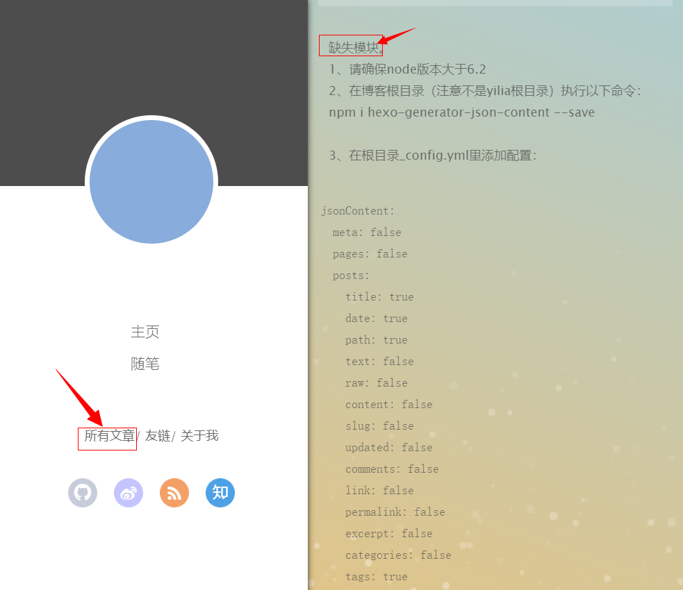
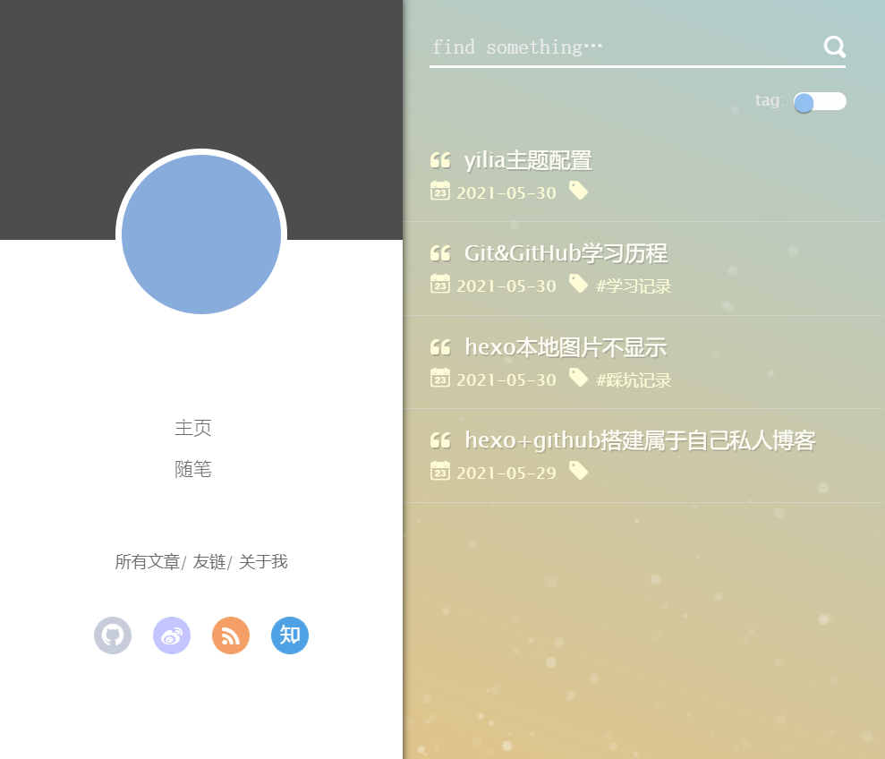
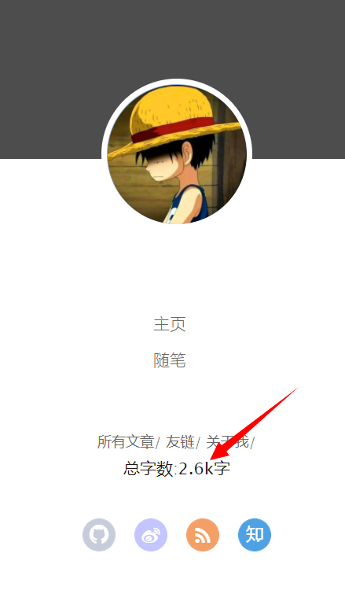
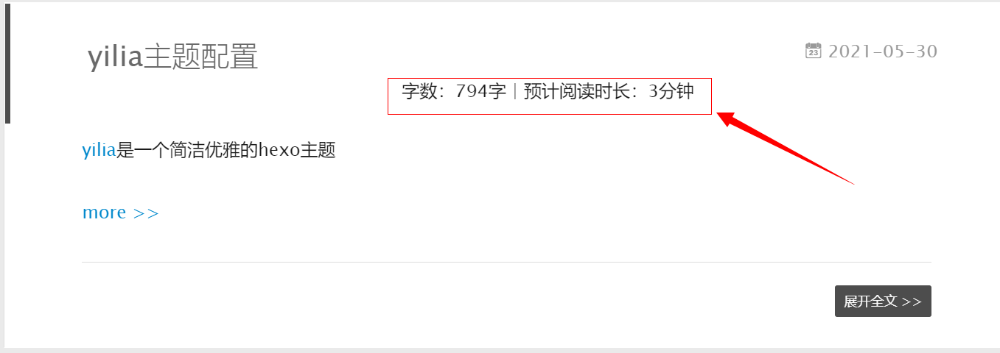
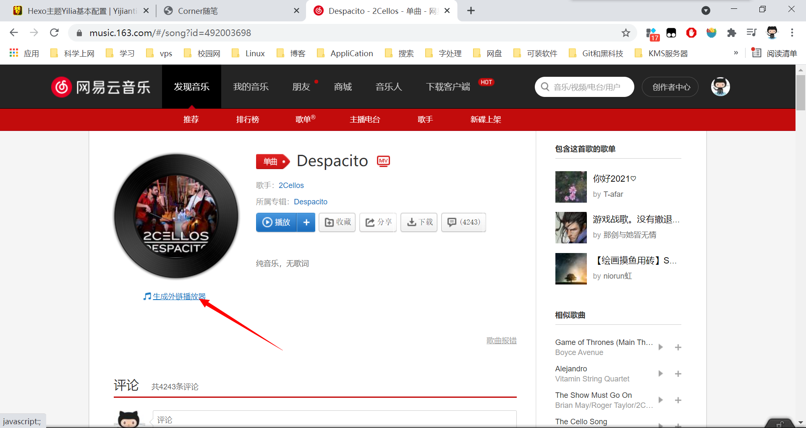
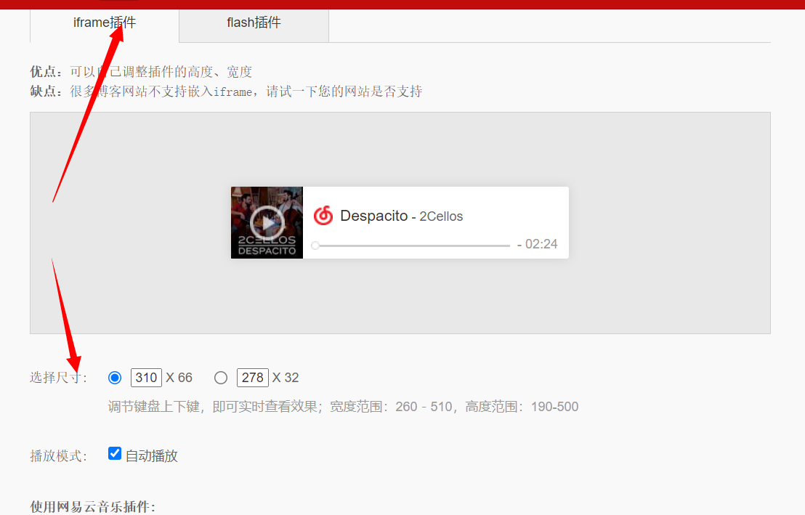
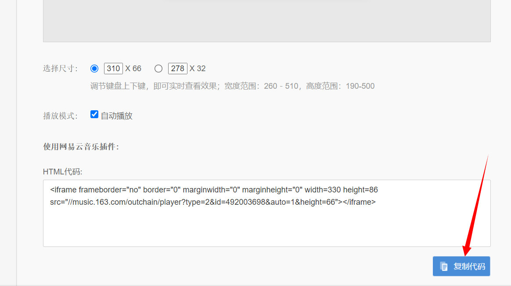
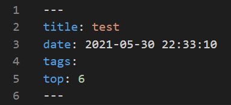
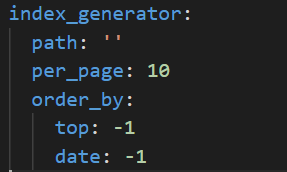
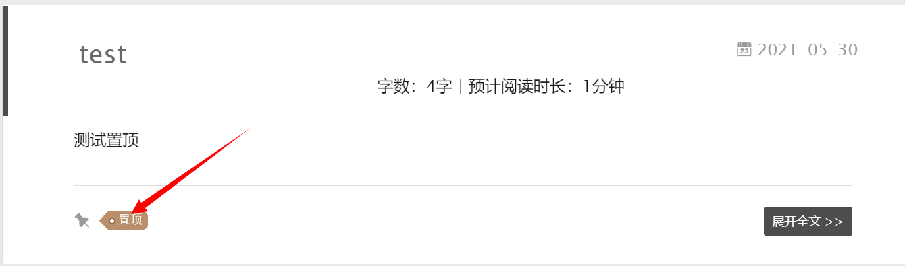

### 1. Install Node.js
> Note: If you use `sudo apt install node npm` directly, there will be a problem that the downloaded version does not match. The Ubuntu warehouse list is the v10 version.
<!--more-->

If you need to install the latest version of Node.js, you can use a PPA software repository or nvm (Node Version Manager) to install and manage multiple versions of Node.js. Here are the steps to install the latest version of Node.js using the PPA software repository:

- Add the PPA repository:`curl -sL https://deb.nodesource.com/setup_16.x | sudo -E bash -`

- Install Node.js:`sudo apt-get install -y nodejs`

- Check the installed Node.js version:`node --version`
- Check installed npm version:`npm --version`
- Update npm:`sudo npm install -g npm`

### 2. Install hexo
Refer to [official github](https://github.com/hexojs/hexo) to install hexo

> Note: add sudo

- Install cnpm(optional)

Since the default server image of npm is abroad, direct calls may time out or be particularly slow. So here is the way to download cnpm.

`npm install -g cnpm --registry=http://registry.npm.taobao.org`

Check the version of cnpm to check whether the installation is successful:

`cnpm -v`

All configuration reference [official document](https://hexo.io/docs/)

### 3. Deploy blog to gitee/github
- Create a new warehouse.
    - For repository name, just fill in "github name+.gitee+.io" (you can access the blog by entering this address `https://corner647.gitee.io` in the browser later)

    - Description is the warehouse introduction, just fill in whatever you want. Create it afterwards.
- Install the Git plugin
   `npm install --save hexo-deployer-git`
- configuration config.yml
```shell
deploy:
    type: git
    repo: Fill in the full path of the warehouse you created on Gitee before, remember to add .git (in fact, paste the clone ssh address of the newly created warehouse)
    branch: master
```
> Note:If you want to push to github, just change the repository here.

- Generate key, ssh verify gitee
`ssh-keygen -t rsa -C "email"`

- Test whether the connection is successful
`ssh -T git@github.com`

> Beware of Proxy Issues

- push to remote
```shell
hexo g		# generate blog 
hexo d		# push blog
```

### 4. yilia theme configuragion
[yilia](https://github.com/litten/hexo-theme-yilia) is a simple and elegant theme for hexo.
- Refer to [official github](https://github.com/litten/hexo-theme-yilia) for installation
- Click **所有文章** on the left,and there will be a prompt that the 模块缺失.
<!--  -->


- Follow the prompts to execute the command in the root directory of the blog
`cnpm i hexo-generator-json-content --save`
- Follow the prompts to add configuration in the root directory _config.yml
```json
jsonContent:
    meta: false
    pages: false
    posts:
      title: true
      date: true
      path: true
      text: false
      raw: false
      content: false
      slug: false
      updated: false
      comments: false
      link: false
      permalink: false
      excerpt: false
      categories: false
      tags: true
```
- Just re-push

<!--  -->


### 5 Configure image resources
Put the picture in **themes/yilia/source/img**, and then directly reference it in the theme configuration file(*themes/yilia/_config.yml*).
```json
avatar: /img/avatar.jpg     #头像图片
favicon: /img/timg.png      #网页图标
weixin: /img/qr_code.jpg    #微信二维码图片
alipay:                     #支付宝二维码
```
### 6 The local picture does not display the problem solution
- Change the value of post_asset_folder in _config.yml to true
- Install hexo-asset-image, a plugin that can upload local images
`npm install https://github.com/EricGerry/hexo-asset-image-0.0.5.git --save`
To install the specified version, you must not use the following command to install, because the version number is wrong.
`npm install hexo-asset-image --save`
In this way, every time a new blog post is created, a folder with the same name will appear for pictures.

- Use md syntax to reference pictures.
``
- Or use css style to specify the image size
``

### 7 The article shows part of the content
In a MarkDown article, just insert <!--more-->, and the content after that will not be displayed. Need to click to expand the full text to be displayed.
Its related configuration is in *themes/yilia/_config.yml*
```json
excerpt_link: more    #文章太长，截断按钮文字
show_all_link: '展开全文'   #文章卡片右下角常驻链接，不需要请设置为false
```

### 8 Added 不蒜子统计
[不蒜子](http://ibruce.info/2015/04/04/busuanzi/), which can be used to count the number of visits to the blog.
- install script
Suanzi can be used for any type of personal site. For hexo, open *themes/your theme/layout/_partial/footer.ejs* and add the following script, of course, it can also be added to the *header*.
```js
<script async src="//busuanzi.ibruce.info/busuanzi/2.3/busuanzi.pure.mini.js">
</script>
```

- Show total site visits
Open *themes/your theme/layout/_partial/footer.ejs* and add the script.
  - 算法a：pv的方式，单个用户连续点击n篇文章，记录n词访问量
```js
<span id="busuanzi_container_site_pv">
    本站总访问量<span id="busuanzi_value_site_pv"></span>次
</span>
```
  - 算法b：uv的方式，单个用户连续点击n篇文章，只记录1次访客数。
```js
<span id="busuanzi_container_site_uv">
    本站访客数<span id="busuanzi_value_site_uv"></span>人次
</span>
```

- Show single article hits
算法：pv的方式，单个用户点击1篇文章，本篇文章记录1次阅读量。
打开themes/yilia/layout/_partial/article.ejs，
在`<%- partial('post/title', {class_name: 'article-title'}) %>`后加下述代码
```js
<!--显示阅读次数-->
<% if (!index && post.comments){ %>
  <br/>
  <a class="cloud-tie-join-count" href="javascript:void(0);" style="color:gray;font-size:14px;">
  <span class="icon-sort"></span>
  <span id="busuanzi_container_page_pv" style="color:#ef7522;font-size:14px;">
            阅读数: <span id="busuanzi_value_page_pv"></span>次 &nbsp;&nbsp;
  </span>
  </a>
<% } %>
<!--显示阅读次数完毕-->
```
> 更多方式见[不蒜子](http://ibruce.info/2015/04/04/busuanzi/)

### 9 Increase word count
It is recommended to use the hexo article word count plug-in[WordCount](https://www.npmjs.com/package/hexo-wordcount)
- install plugin
`npm install hexo-wordcount --save`
The plug-in has two statistical methods, post and total. Generally speaking, the post statistics are introduced into the article and displayed, and the total word count statistics are displayed on the home page where you want to place them (**footer, left-col** or other places).
My blog is imported to the left column.
- In **yilia/layout/_partial/left-col.ejs** file, the **class name is header-smart-menu** and add the following code to display the total word count.
```js
<div class="post-count" style='font-size:14px'>总字数:<%= totalcount(site, '0,0.0a') %>字</div>
```

<!--  -->
- In the **yilia/layout/_partial/article.ejs** file, **class name is article-header** and add the following code to display the number of words and estimated reading time of a single article.
```js
<div align="center" class="post-count">
    字数：<%= wordcount(post.content) %>字 | 预计阅读时长：<%= min2read(post.content) %>分钟
</div>
```

<!--  -->

> 注：node版本7.6.0之前的，WordCount需要安装2.x版本

`npm install hexo-wordcount@2 --save             2.x版本`

### 10 Add NetEase Cloud Music
We can directly search for the music we want to insert on Netease Cloud, and then click to generate an external link player (you can choose whether to play automatically)


Then you can generate the corresponding html code according to your settings, and insert the obtained html code into the position you want to insert.




### 11 Add article directory
The yilia theme has its own directory, open *themes/yilia/_config.yml*, and there are *toc* settings in it. After setting, add *toc: 1* at the beginning of each article.

### 12 About the problem of losing the avatar of the secondary content of hexo
The problem is that *avatar: /img/avatar.jpg* is written as *avatar: img/avatar.jpg*

### 13 How to pin the article
- install [plugin](https://github.com/netcan/hexo-generator-index-pin-top)<!--more-->
```shell
npm uninstall hexo-generator-index --save
npm install hexo-generator-index-pin-top --save
```
- Configure top criteria
Open *themes/yilia/layout/post.ejs* and insert the following code directly at the front.
```js
<% if (page.top) { %>
  <i class="fa fa-thumb-tack"></i>
  <font color=7D26CD>置顶</font>
  <span class="post-meta-divider">|</span>
<% } %>
```
- Configuration article
Just add the top option in the Front-matter of the article that needs to be pinned to the top. The larger the number after top, the higher the priority


- Priority configuration
Modify the root directory configuration file *_config.yml*, the *top* value *-1* indicates the reverse order according to the *top* value (just set *1* in the positive order), and the *date* is also reversed according to the creation date.



- Effect



### 14 鼠标点击小心心的设置
- Add the file *love.js* under the *themes/yilia/source* path, the content is as follows
```js
!function(e,t,a){function r(){for(var e=0;e<s.length;e++)s[e].alpha<=0?(t.body.removeChild(s[e].el),s.splice(e,1)):(s[e].y--,s[e].scale+=.004,s[e].alpha-=.013,s[e].el.style.cssText="left:"+s[e].x+"px;top:"+s[e].y+"px;opacity:"+s[e].alpha+";transform:scale("+s[e].scale+","+s[e].scale+") rotate(45deg);background:"+s[e].color+";z-index:99999");requestAnimationFrame(r)}function n(){var t="function"==typeof e.onclick&&e.onclick;e.onclick=function(e){t&&t(),o(e)}}function o(e){var a=t.createElement("div");a.className="heart",s.push({el:a,x:e.clientX-5,y:e.clientY-5,scale:1,alpha:1,color:c()}),t.body.appendChild(a)}function i(e){var a=t.createElement("style");a.type="text/css";try{a.appendChild(t.createTextNode(e))}catch(t){a.styleSheet.cssText=e}t.getElementsByTagName("head")[0].appendChild(a)}function c(){return"rgb("+~~(255*Math.random())+","+~~(255*Math.random())+","+~~(255*Math.random())+")"}var s=[];e.requestAnimationFrame=e.requestAnimationFrame||e.webkitRequestAnimationFrame||e.mozRequestAnimationFrame||e.oRequestAnimationFrame||e.msRequestAnimationFrame||function(e){setTimeout(e,1e3/60)},i(".heart{width: 10px;height: 10px;position: fixed;background: #f00;transform: rotate(45deg);-webkit-transform: rotate(45deg);-moz-transform: rotate(45deg);}.heart:after,.heart:before{content: '';width: inherit;height: inherit;background: inherit;border-radius: 50%;-webkit-border-radius: 50%;-moz-border-radius: 50%;position: fixed;}.heart:after{top: -5px;}.heart:before{left: -5px;}"),n(),r()}(window,document);
```
- Open hexo *themes/yilia/layout/_partial/footer.ejs* and add the following code at the end
```js
<!--页面点击小红心-->
<script type="text/javascript" src="/love.js"></script>
```

### 15 Add copyright statement
- Configure yilia
Add code where marked
```js
<div class="article-entry" itemprop="articleBody">
  <% if (post.excerpt && index){ %>
    <%- post.excerpt %>
    <% if (theme.excerpt_link) { %>
      <a class="article-more-a" href="<%- url_for(post.path) %>#more"><%= theme.excerpt_link %> >></a>
    <% } %>
  <% } else { %>
    <%- post.content %>
  <% } %>
  <-- 在此处添加代码-->
  <% if ((theme.reward_type === 2 || (theme.reward_type === 1 && post.reward)) && !index){ %>
  <div class="page-reward">
    <a href="javascript:;" class="page-reward-btn tooltip-top">
    <div class="tooltip tooltip-east">
```
添加的代码如下
```js
<!-- 增加版权声明 -->

<%
  var sUrl = url.replace(/index\.html$/, '');
  sUrl = /^(http:|https:)\/\//.test(sUrl) ? sUrl : 'https:' + sUrl;
%>
<% if ((theme.declare_type === 2 || (theme.declare_type === 1 && post.declare)) && !index){ %>
  <div class="declare">
    <strong>本文作者：</strong>
    <% if(config.author != undefined){ %>
      <%= config.author%>
    <% }else%>
    <br>
    <strong>本文链接：</strong>
    <a rel="license" href="<%=sUrl%>"><%=sUrl%></a>
    <br>
    <strong>版权声明：</strong>
    本作品采用
    <a rel="license" href="<%= theme.licensee_url%>"><%= theme.licensee_name%></a>
    进行许可。转载请注明出处！
    <% if(theme.licensee_img != undefined){ %>
      <br>
      <a rel="license" href="<%= theme.licensee_url%>">"/></a>
    <% } %>
  </div>
<% } else {%>
  <div class="declare" hidden="hidden"></div>
<% } %>

<!-- 增加版权声明结束 -->
```
Create a new file *themes/yilia/source-src/css/declare.scss* and add the following CSS code
```CSS
.declare {
    background-color: #eaeaea;
    margin-top: 2em;
    border-left: 3px solid #ff1700;
    padding: .5em 1em;
}
```
Open *themes/yilia/source-src/css/main.scss* and add the following code
```scss
@import "./declare";
```
- Configuration display
Open *themes/yilia/_config.yml* and add the following content in it
```yml
#版权基础设定：0-关闭声明； 1-文章对应的md文件里有declare: true属性，才有版权声明； 2-所有文章均有版权声明
#当前应用的版权协议地址。
#版权协议的名称
#版权协议的Logo

declare_type: 1
licensee_url: https://creativecommons.org/licenses/by-nc-sa/4.0/
licensee_name: '知识共享署名-非商业性使用-相同方式共享 4.0 国际许可协议'
licensee_img: https://i.creativecommons.org/l/by-nc-sa/4.0/88x31.png
```
Then set the attribute in the header of the *md* file of the article that needs copyright statement.
```js
declare:true
```

### 16 End of text (no conflict with more)
- Open the *themes\yilia\layout\_partial\article.ejs* file, and add the code in the following code.
```js
<% if (!post.noDate){ %>
        <%- partial('post/date', {class_name: 'archive-article-date', date_format: null}) %>
        <% } %>
      </header>
    <% } %>
    <div class="article-entry" itemprop="articleBody">
      <% if (post.excerpt && index){ %>
        <%- post.excerpt %>
        <% if (theme.excerpt_link) { %>
          <a class="article-more-a" href="<%- url_for(post.path) %>#more"><%= theme.excerpt_link %> >></a>
        <% } %>
      <% } else { %>
        <%- post.content %>
      <% } %>
```
添加的代码如下
```js
<% if ((theme.essayending_type === 2 || (theme.essayending_type === 1 && post.essayending)) && !index){ %>
       <% if  (!index){ %>
         <div class="essayending">
           <div>
            <div style="text-align:center;color: #ccc;font-size:22px;">
            <br/>
            <br/>
            -------------本文结束<i class="fa fa-paw"></i>感谢您的阅读-------------
            <br/>
            <br/>
             <br/>
             <br/>
            </div>
           </div>
         </div>
       <% } else {%>
         <div class="essayending" hidden="hidden"></div>
       <% } %>

   <% } %>
```
- Configuration
Open *theme\yilia\_config.yml* and add the following content in the appropriate position.
```yml
#文章结束
essayending_type: 2 #0关闭文章结束提示 2全开 1需要在文章开头加上 essayending: true
```
> 0表示关闭文章结束提示
2表示全开
1表示需要在文章开头加上 essayending: true 才会开启文章结束提示

### 17 Add pet
- Install plugin
`npm install --save hexo-helper-live2d`

- Download model
Select the corresponding model to install, [project address](https://github.com/xiazeyu/live2d-widget-models)
[Effect display website](https://huaji8.top/post/live2d-plugin-2.0/), here I choose the *live2d-widget-model-hijiki* model package.
`npm install live2d-widget-model-hijiki`

- Configuration
Open the _config.yml file in the root directory of the blog, and add the following code at the end.
```yml
live2d:
  enable: true
  scriptFrom: local
  pluginRootPath: live2dw/
  pluginJsPath: lib/
  pluginModelPath: assets/
  tagMode: false
  debug: false
  model:
    use: live2d-widget-model-hijiki
  display:
    position: right
    width: 150
    height: 300
  mobile:
    show: true
```

### 18 Article encryption
[hexo-blog-encrypt](https://github.com/D0n9X1n/hexo-blog-encrypt)