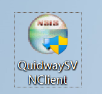
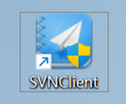
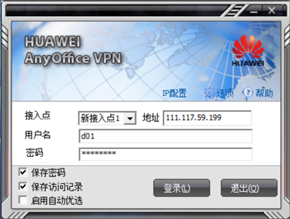
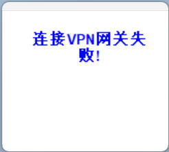
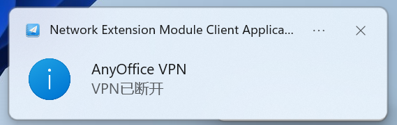
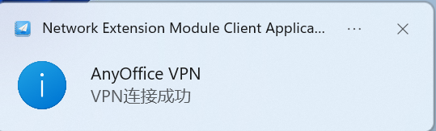

> If you want to access the web interface of some 172.* network segments locally, you need to use method two to connect.

### Method 1: Connect directly via ssh
| Intranet ip | Mapped port | Command |
| :-----:| :----: | :----: |
| 172.17.0.153 | 8002 | ssh pan@150.158.17.239 -p 8002 |
| 172.17.0.154 | 8003 | ssh pan@150.158.17.239 -p 8003 |
| 172.17.0.155 | 8004 | ssh pan@150.158.17.239 -p 8004 |
| 172.17.0.156 | 8005 | ssh pan@150.158.17.239 -p 8005 |
| 172.17.0.157 | 8006 | ssh pan@150.158.17.239 -p 8006 |
| 172.17.0.158 | 8007 | ssh pan@150.158.17.239 -p 8007 |
| 172.17.0.159 | 8008 | ssh pan@150.158.17.239 -p 8008 |
<!--more-->

### Method 2: Connect to LAN through VPN
#### 1.	Download and install QuidwaySVNClient
Link: https://pan.baidu.com/s/1wHi11sZe6zZSJTZ2B3MAVg?pwd=mmmf
Extraction code: mmmf

#### 2. Open SVNClient, enter ip, account number, password

#### 3. Click to log in, due to version reasons, it may appear

At this time, you need to log in in compatibility mode:
- Click login repeatedly, the windows system will automatically detect that the currently running software version is not compatible, and the pop-up window will run in compatibility mode, just agree.
- Right-click when opening the software, select Compatibility Login

#### 4. After successful login, connect to the server via ssh

Taking windows as an example, the power shell of windows has built-in ssh service, so there is no need to download software such as xshell.

Type `ssh pan@172.17.0.153` in the terminal, and then enter the password. You can connect to the node. After the connection is successful, as shown in the figure below.

#### 5.	The password of all nodes remains unchanged, which is still 123456, as long as it is a previously deployed node, it can be connected. But only the server with ip ending in 153 can access the Internet.

#### 6.	The VPN account is used by a single user, and it will be squeezed out if multiple users use it together.
| Account | Password | User |
| :-----:| :----: | :----: |
| d01 | Web101_w | 孟庆宇 |
| d02 | Web101_w | 秦晓亮 |
| d03 | Web101_w | 田丰源 |
| d04 | Web101_w | 栾云飞 |
| u3 | Web101_w | 李哲 |
| d06 | Web101_w | free |
| d07 | Web101_w | free |
| d08 | Web101_w | free |
| d09 | Web101_w | free |
| d10 | Web101_w | free |

#### 7. Remote Desktop
The Ubuntu system with ip ending in 153 is the latest version 22.4, and remote desktop has been enabled, if necessary, it can be controlled through remote desktop. It can be connected through the RDP remote desktop that comes with windows. The password has been initialized to 123456

#### 8. Principle
Various protocol services that need to be accessed on the server side are disabled, including ssh. Therefore, it cannot be transmitted through the intranet, because internal nodes cannot expose specific ports. Therefore, only through VPN dial-up, the computers are all in the same network segment, such as 172.*, which is equivalent to that the computers are all in the same LAN. There is no problem of exposing the port to the public network.

In theory, VPN dial-up should be a protocol, but using the dial-up system that comes with Windows and Ubuntu doesn't work. It is speculated that this software of Huawei uses a specific port number of a specific protocol that happens to be adopted by the school, and it is port forwarded at the routing level. So if it is a non-Windows system, in theory, as long as a specific port number is found, it can also dial through the VPN. Generally, these are message ports such as udp53 and 69.

> Internet access problem In the case of not adding a soft routing system, it should be able to meet the requirements of the Internet through the NAT network through the LAN. Without destroying the network configuration with the ip tail number 153 and without changing the ip address, you can toss about it casually.

